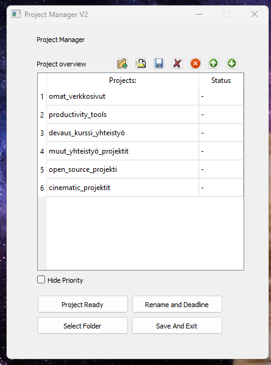
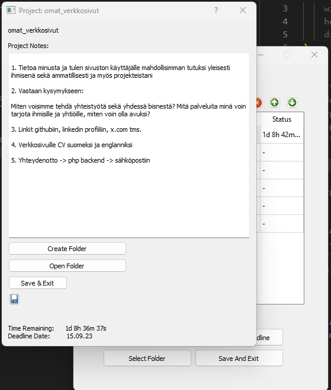
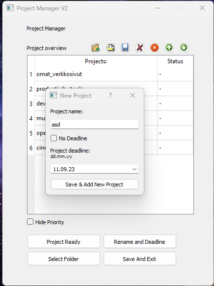
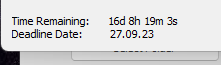
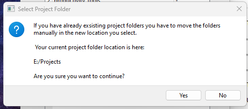

# Project Manager

Simple desktop application for easy and simple project management. 

Features: You can make and delete projects, change the order, hide the priority number, set the main project folder,
write notes for each project, delete projects and all project data, or only delete the project in the manager (not files). You can set deadlines for projects and mark them as ready.
Deadline changes are blocked, because what's the point of a deadline if you're able to change it?

This is one of my first projects, and it's using Python and PyQt. As one of my first projects (second first), this project demonstrates my ability to learn quickly and complete even difficult projects for a beginner Python programmer.

This project was completed in April 2023, but I uploaded it to GitHub later.

## Images:

)
)
)
)
)
